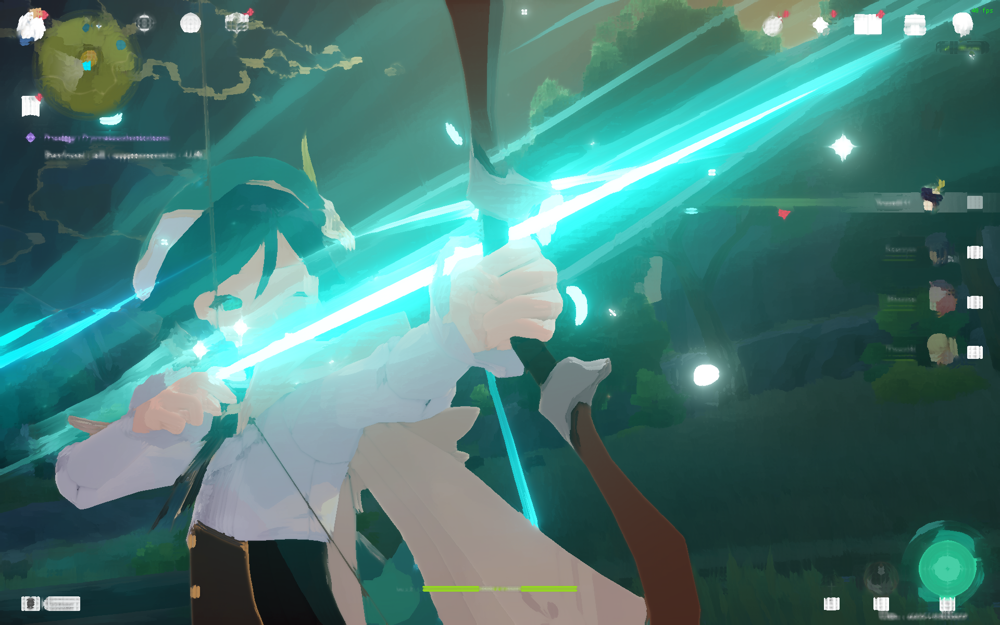
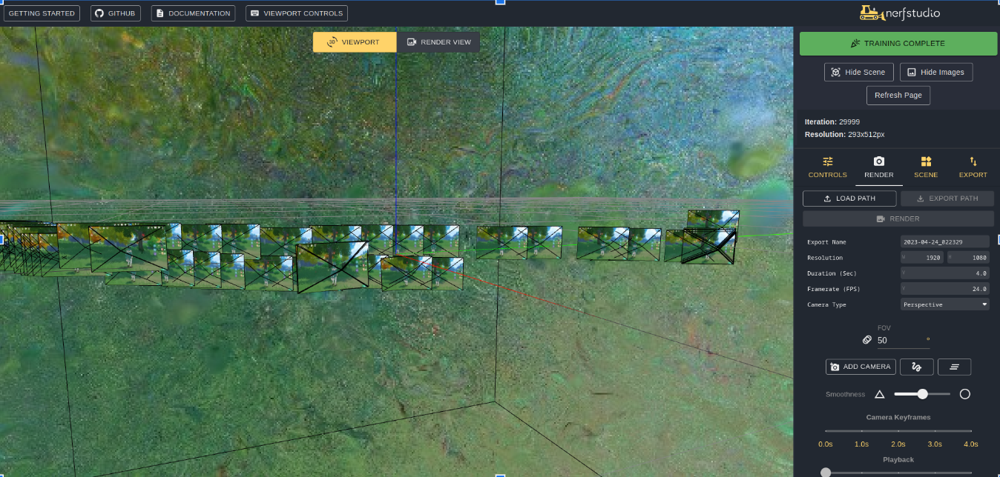

# **Title:** GenshinLeRF

## **Team members:** Pierre Le, Rahul Shah, Jason Yang, Levy Deng

# Problem Description
From lecture and projects we've learned how to apply shaders on top of meshes, and with the onset of state of the art rendering techniques using NeRF, we thought it would be interesting to merge the two ideas together -- why not try to apply LeRF / NeRF into game scenes, instead of simply pictures.

## Lots of Problems, Not many answers
NeRF is fundamentally encoding objects and primitives into a neural network. Demos exist for the application of NeRF in projects like LeRF (Language encoded Radiance Fields), which applies shading on top of scenes indicating primitives that belong to text input. Embedding this technology into a game engine is not trivial either, since the rendering pipeline is fairly complex. This brought to us the idea of shaders, so why not take an existing game, inject shaders into it, and allow NeRF to interact with the rendering engine that way? Unfortunately, the answer to this question is not trivial.

## Why it is non-trivial

Firstly, released games do not generally support modifications to the game files to add functionality to the game, even for simple graphics modifications. In fact, in most cases, game developers goe out of their way to make it hard for users to modify their game post-production through the use of anti-cheat software. To get our shaders working, we have to modify the rendering pipeline of the game to apply those shaders, which means we have to subvert the anti-cheat, or to use drivers in the GPU themselves to support these shaders.
Even if we are able to get shaders working, there is no guarantee that NeRF would behave exactly as expected, since we need to capture the frame buffer to feed to NeRF as input, which effectively means we are introducing NeRF as part of the last stage of the rendering pipeline. This means that, although it could allow us to potentially add interesting shading effects - like LeRF - it also means that we need to train models to exploit the encoding provided by NeRF, and these models would be extremely purpose specific. This integration is also non-trivial. One such example of this are features regarding angles, which is not easily obtained from the game software.

## Our Method of Attack

To resolve our first challenge of making post-modifications to the game files to support shaders, we will use a game which already has either their defense mechanisms subverted (most Unity-derived games fit into this category due to their il2cpp), and an injector working for us, so to allow us to focus solely on creating the shaders and tuning them for the game. To get the scene so that it can be fed into NeRF, we will play around the game files and obtain all of the necessary features required for training the model.

To resolve the difficulty of attaching NeRF onto our shaders, as a proof of concept, we will run NeRF as a separate process on the framebuffer of the game, running entirely separately to avoid the problem of injecting more DLL's into the games files. Even if the rendering times for LeRF / NeRF are significantly longer than what's required for a game, we should be alright since they are running semi-independently.

# Goals and Deliverables
- What we're trying to accomplish:
  - We are attempting to implement shaders in a video game alongside using LeRF / NeRF on video game scenes. 
- What results we're going for:
    - Embedding shaders with LeRF to interact with game engine using injections/mods
- Why we think we can accomplish these goals:
    - NeRF code is open source and we should have computing resources for training any neural network models
    - There is existing documentation and tutorials on how to inject shaders 
- Answering questions mentioned: - Since this is a graphics class you will likely define the kind of images you will create (e.g. including a photo of a new lighting effect you will simulate).
    - The image should be a character posing in a scene with shaders in the background or a game scene.
<table>
  <tr>
    <td> </td>
    <td> </td>
   </tr> 
   <tr>
      <td></td>
      <td>
  </td>
  </tr>
</table>

- If you are working on an interactive system, describe what demo you will create.
    - If we are able to implement LeRF, we should have text input to query any objects in a scene.
- Define how you will measure the quality / performance of your system (e.g. graphs showing speedup, or quantifying accuracy).
    - We measure by the quality of the shaders on the environment as well as the accuracy of LeRF of game objects
- What questions do you plan to answer with your analysis?
    - We hope to implement shaders to create visually stunning images and use LeRF/NeRF to recreate a game enviroment and sustain accurate queries of game objects
- In (1), describe what you believe you must accomplish to have a successful project and achieve the grade you expect (i.e. your baseline plan – planning for some unexpected problems would make sense)
    - At minimum , we expect to be able to apply shaders to a video game. 
    - Ideally, we want a tuned LeRF/NeRF model to get an environment of a game.
- In (2), describe what you hope to achieve if things go well and you get ahead of schedule (your aspirational plan).
    - Our goal is to implement LeRF alongside the shaders. We have just obtained the source code for LeRF from the paper's authors.
    - We might be interested in having shaders and LeRF in other games or game engines.

# Schedule
- Week 1 (week of 04/03/2023 to 04/10/2023):
  - **Finish the Shaders**: be able to have various custom shaders
  - Look into different types of shaders (i.e. fragment shaders)
  - Look into how to obtain the necessary features from the game scene for NeRF studio (angles, positions, etc.)
- Week 2 (04/10/2023)
  - **Apply Shaders to Genshin**: Work on injecting shaders to a real game engine
  - Prepare a script for the Milestone Video
  - Start working on the Milestone Status Report Webpage
- Week 3 (04/17/2023)
  - Work on LERF integration
  - Record the Milestone Video
  - Finish and submit the Milestone Status Report Webpage
  - Make initial presentation draft
- Week 4 (04/24/2023)
  - Prepare for final presentation with a mock presentation 
  - Give final presentation
  - Fill out [Peer Reviews](https://forms.gle/3HUE1mw6CSf8JkJY8).

# Resources
<!-- Pls put a line between citations -->
[This is how we will inject Shaders into Genshin Impact](https://github.com/sefinek24/Genshin-Impact-ReShade)

[LeRF (Language Embedded Radiance Fields)](https://www.lerf.io/)

[LeRF Code](https://github.com/kerrj/lerf)

[NerfStudio](https://github.com/nerfstudio-project/nerfstudio)

[ARCore](https://developers.google.com/ar)